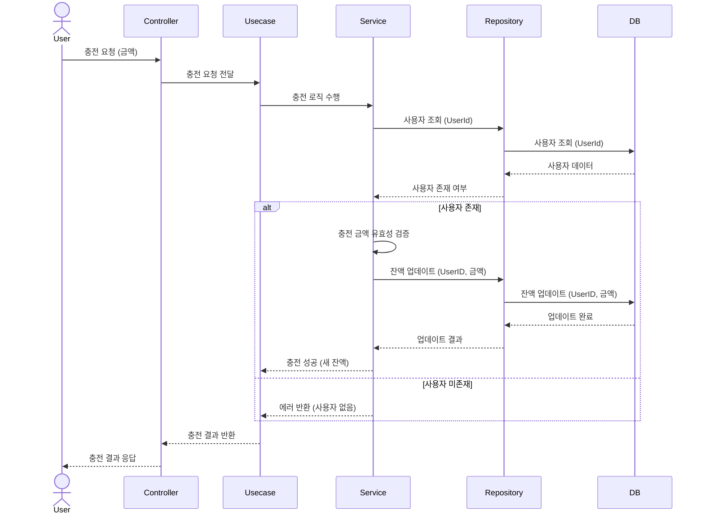
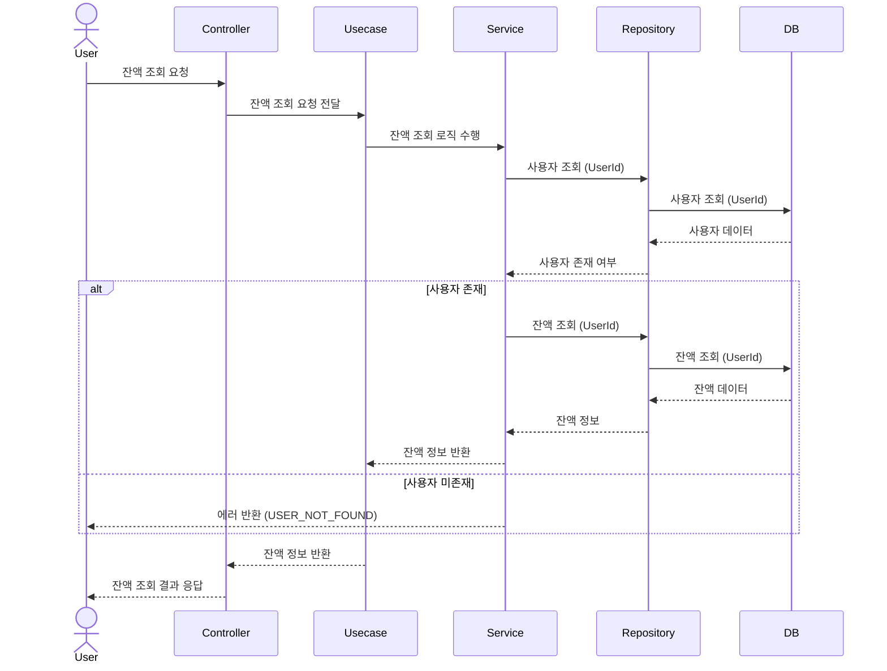
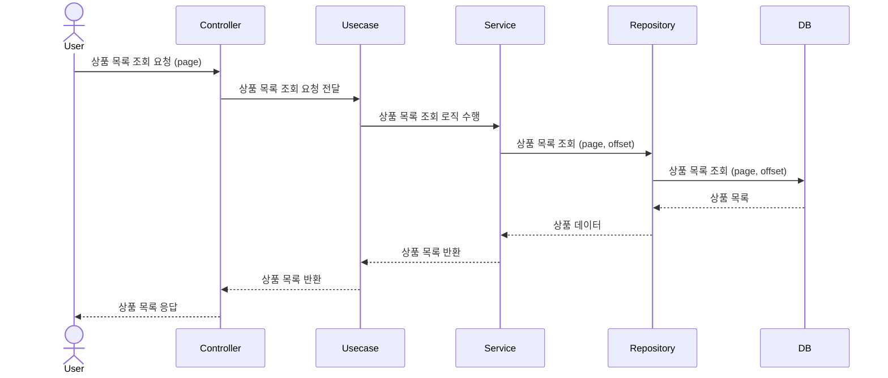
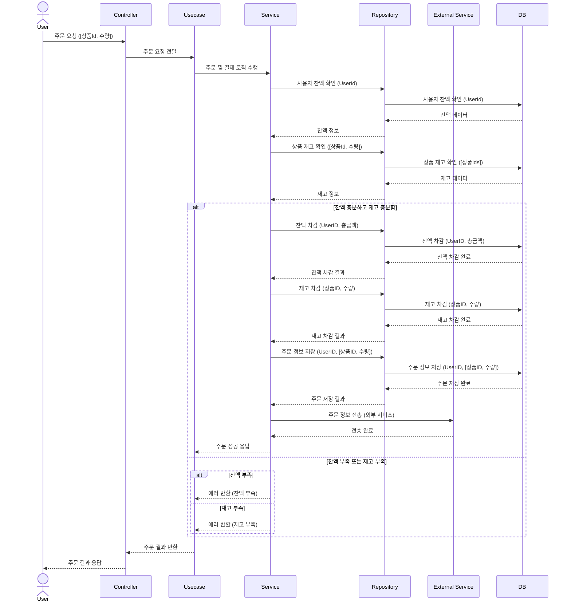
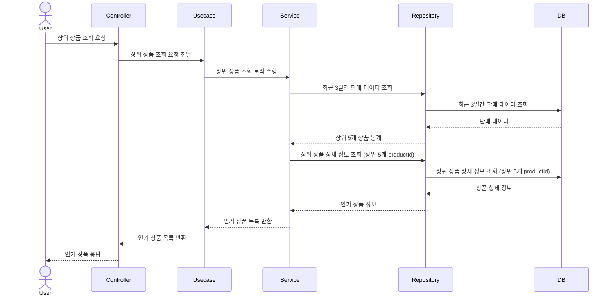
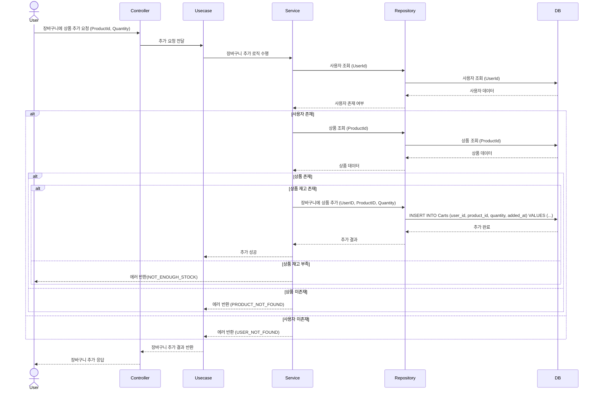
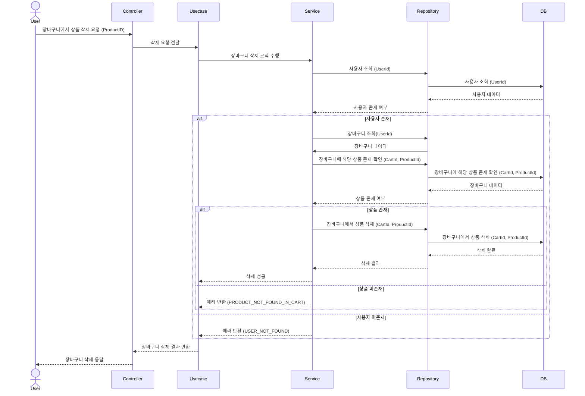
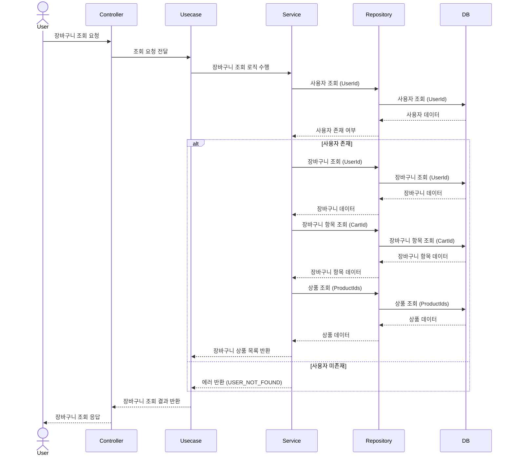

# 항해 + 이커머스

> ### Description
- `e-커머스 상품 주문 서비스`를 구현해 봅니다.
- 상품 주문에 필요한 메뉴 정보들을 구성하고 조회가 가능해야 합니다.
- 사용자는 상품을 여러개 선택해 주문할 수 있고, 미리 충전한 잔액을 이용합니다.
- 상품 주문 내역을 통해 판매량이 가장 높은 상품을 추천합니다.

> ### Requirements
- 아래 4가지 API 를 구현합니다.
   - 잔액 충전 / 조회 API
   - 상품 조회 API
   - 주문 / 결제 API
   - 인기 판매 상품 조회 API
- 각 기능 및 제약사항에 대해 단위 테스트를 반드시 하나 이상 작성하도록 합니다.
- 다수의 인스턴스로 어플리케이션이 동작하더라도 기능에 문제가 없도록 작성하도록 합니다.
- `동시성 이슈`를 고려하여 구현합니다.
- 재고 관리에 문제 없도록 구현합니다.

> ### 잔액 충전 (POST - /balance/charge)
- 사용자 식별자 및 충전할 금액을 받아 잔액을 충전합니다.

> ### 잔액 조회 (GET - /balance)
- 사용자 식별자를 통해 해당 사용자의 잔액을 조회합니다.

> ### 상품 조회 (GET - /product)
- 상품 정보 ( ID, 이름, 가격, 잔여수량 ) 을 조회하는 API 를 작성합니다.
- 조회시점의 상품별 잔여수량이 정확하면 좋습니다.

> ### 주문/결제 (POST - /product/order/:orderId)
- 사용자 식별자와 (상품 ID, 수량) 목록을 입력받아 주문하고 결제를 수행하는 API 를 작성합니다.
- 결제는 기 충전된 잔액을 기반으로 수행하며 성공할 시 잔액을 차감해야 합니다.
- 데이터 분석을 위해 결제 성공 시에 실시간으로 주문 정보를 데이터 플랫폼에 전송해야 합니다. ( 데이터 플랫폼이 어플리케이션 `외부` 라는 가정만 지켜 작업해 주시면 됩니다 )

> 데이터 플랫폼으로의 전송 기능은 Mock API, Fake Module 등 다양한 방법으로 접근해 봅니다.

> ### 상위 상품 조회 (GET - /product/top)
- 최근 3일간 가장 많이 팔린 상위 5개 상품 정보를 제공하는 API 를 작성합니다.
- 통계 정보를 다루기 위한 기술적 고민을 충분히 해보도록 합니다.

> ### 장바구니 (POST - /cart/add, DELETE - /cart/delete, GET - /cart)
- 사용자는 구매 이전에 관심 있는 상품들을 장바구니에 적재할 수 있습니다.
- 이 기능을 제공하기 위해 `장바구니에 상품 추가/삭제` API 와 `장바구니 조회` API 가 필요합니다.
- 위 두 기능을 제공하기 위해 어떤 요구사항의 비즈니스 로직을 설계해야할 지 고민해 봅니다.

- 장바구니 추가 (POST - /cart/add)

- 장바구니 삭제 (DELETE - /cart/delete)

- 장바구니 조회 (GET - /cart)

# MileStone
- https://github.com/users/F1rstID/projects/3

# ERD

# API Docs